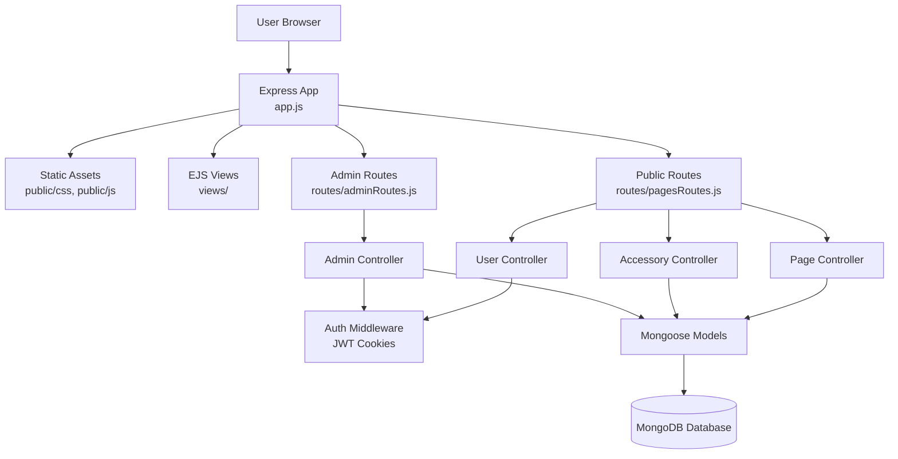
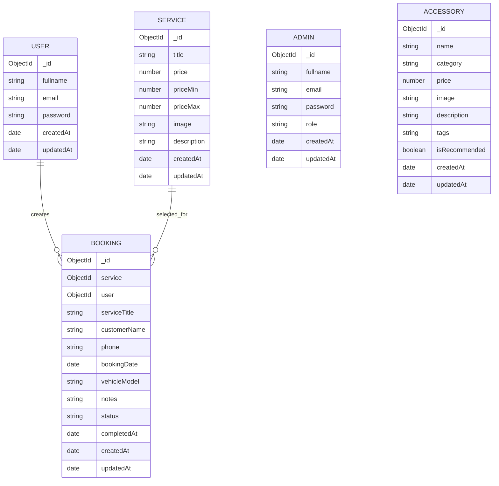
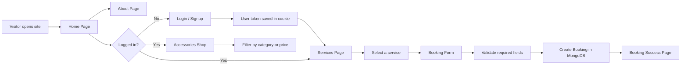
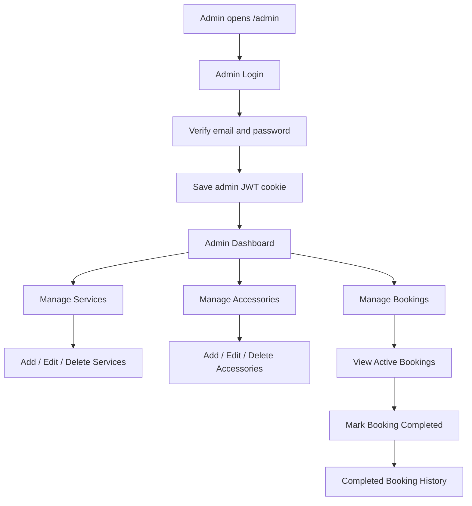
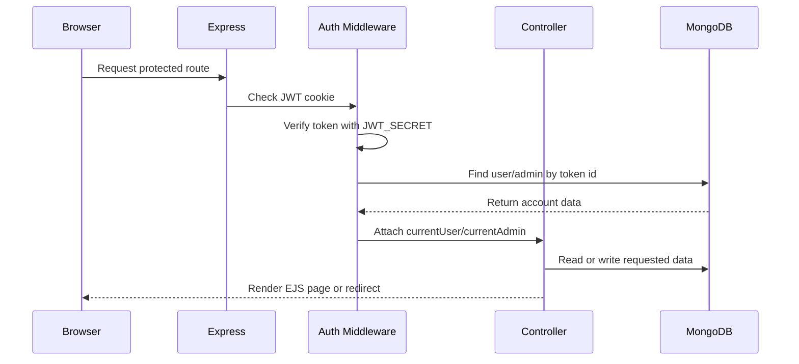

# CarCraze

CarCraze is a car service and accessories web application built with Node.js, Express, EJS, MongoDB, and Bootstrap. The application allows customers to browse services, book car service appointments, view recommended accessories, and manage their account. It also includes an admin panel for managing services, accessories, active bookings, and completed booking history.

## Table of Contents

- [Features](#features)
- [Tech Stack](#tech-stack)
- [Project Structure](#project-structure)
- [System Architecture](#system-architecture)
- [Database Design](#database-design)
- [User Flow](#user-flow)
- [Admin Flow](#admin-flow)
- [Authentication Flow](#authentication-flow)
- [Installation](#installation)
- [Environment Variables](#environment-variables)
- [Running the Project](#running-the-project)
- [Available Routes](#available-routes)
- [Data Models](#data-models)
- [Future Improvements](#future-improvements)

## Features

### Customer Features

- Home, About, Services, Booking, and Shop pages.
- User registration and login.
- Protected service, booking, and accessories pages.
- JWT-based authentication stored in an HTTP-only cookie.
- Service listing with latest services shown first.
- Booking form with selected service support.
- Booking confirmation page with submitted booking details.
- Accessories shop with category and price filtering.
- Recommended accessories section.
- Forgot password page placeholder for future email reset support.

### Admin Features

- Admin registration and login.
- Protected admin dashboard.
- Add, view, edit, and delete car services.
- Add, view, edit, and delete car accessories.
- View active bookings.
- Mark bookings as completed.
- View completed booking history.
- Admin forgot password page placeholder.
- Admin JWT authentication stored in an HTTP-only cookie.

## Tech Stack

| Layer | Technology |
| --- | --- |
| Runtime | Node.js |
| Server Framework | Express.js |
| View Engine | EJS |
| Database | MongoDB |
| ODM | Mongoose |
| Authentication | JSON Web Token |
| Password Hashing | bcrypt / bcryptjs |
| Styling | Bootstrap, custom CSS |
| Environment Config | dotenv |

## Project Structure

```text
CarCraze/
|-- app.js
|-- package.json
|-- package-lock.json
|-- README.md
|-- config/
|   `-- db.js
|-- controllers/
|   |-- accessoryController.js
|   |-- adminController.js
|   |-- homeController.js
|   |-- pageController.js
|   |-- serviceController.js
|   `-- userController.js
|-- middleware/
|   `-- auth.js
|-- models/
|   |-- Accessory.js
|   |-- Admin.js
|   |-- Booking.js
|   |-- CarServices.js
|   |-- service.js
|   `-- User.js
|-- public/
|   |-- css/
|   `-- js/
|-- routes/
|   |-- adminRoutes.js
|   `-- pagesRoutes.js
`-- views/
    |-- admin/
    |-- auth/
    |-- pages/
    `-- partials/
```

## System Architecture



## Database Design



## User Flow



## Admin Flow



## Authentication Flow



## Installation

1. Clone or download the project.
2. Open the project folder.
3. Install dependencies:

```bash
npm install
```

4. Create a `.env` file in the project root.
5. Add the required environment variables.
6. Start the application.

## Environment Variables

Create a `.env` file in the root directory:

```env
PORT=3000
MONGO_URI=mongodb://127.0.0.1:27017/carcraze
JWT_SECRET=your_secure_jwt_secret
```

| Variable | Description |
| --- | --- |
| `PORT` | Port used by the Express server. Defaults to `3000` if not provided. |
| `MONGO_URI` | MongoDB connection string. Local MongoDB and MongoDB Atlas URLs are supported. |
| `JWT_SECRET` | Secret key used to sign and verify user and admin JWT tokens. |

## Running the Project

Start the server:

```bash
npm start
```

Then open:

```text
http://localhost:3000
```

If MongoDB is not connected or the connection string is invalid, the server will show a clear database connection error in the terminal.

## Available Routes

### Customer Routes

| Method | Route | Description | Protected |
| --- | --- | --- | --- |
| GET | `/` | Render main home page | No |
| GET | `/about` | Render about page | No |
| GET | `/services` | Display available services | Yes |
| GET | `/booking` | Render booking form | Yes |
| POST | `/booking` | Confirm service booking | Yes |
| GET | `/booking/success` | Show booking confirmation | Yes |
| GET | `/shop` | Display accessories shop | Yes |
| GET | `/accessories` | Display accessories shop alias | Yes |
| GET | `/signup` | Render user signup page | No |
| POST | `/signup` | Create user account | No |
| GET | `/login` | Render user login page | No |
| POST | `/login` | Authenticate user | No |
| GET | `/forgot-password` | Render user forgot password page | No |
| POST | `/forgot-password` | Check account for password help | No |
| POST | `/logout` | Log out user | Yes |

### Admin Routes

| Method | Route | Description | Protected |
| --- | --- | --- | --- |
| GET | `/admin` | Redirect to admin login | No |
| GET | `/admin/login` | Render admin login page | No |
| POST | `/admin/login` | Authenticate admin | No |
| GET | `/admin/register` | Render admin registration page | No |
| POST | `/admin/register` | Create admin account | No |
| GET | `/admin/dashboard` | Render admin dashboard | Yes |
| GET | `/admin/services` | List services | Yes |
| GET | `/admin/services/add` | Render add service page | Yes |
| POST | `/admin/services` | Create service | Yes |
| GET | `/admin/services/:id/edit` | Render edit service page | Yes |
| POST | `/admin/services/:id/edit` | Update service | Yes |
| POST | `/admin/services/:id/delete` | Delete service | Yes |
| GET | `/admin/accessories` | List accessories | Yes |
| GET | `/admin/accessories/add` | Render add accessory page | Yes |
| POST | `/admin/accessories` | Create accessory | Yes |
| GET | `/admin/accessories/:id/edit` | Render edit accessory page | Yes |
| POST | `/admin/accessories/:id/edit` | Update accessory | Yes |
| POST | `/admin/accessories/:id/delete` | Delete accessory | Yes |
| GET | `/admin/bookings` | List active bookings | Yes |
| POST | `/admin/bookings/:id/complete` | Mark booking completed | Yes |
| GET | `/admin/bookings/history` | List completed bookings | Yes |
| GET | `/admin/forgot-password` | Render admin forgot password page | No |
| POST | `/admin/forgot-password` | Check admin account for password help | No |
| POST | `/admin/logout` | Log out admin | Yes |

## Data Models

### User

Stores customer account information.

- `fullname`: Customer name.
- `email`: Unique customer email.
- `password`: Hashed password.
- `createdAt` and `updatedAt`: Automatic timestamps.

### Admin

Stores admin account information.

- `fullname`: Admin name.
- `email`: Unique admin email.
- `password`: Hashed password.
- `role`: Admin role, either `admin` or `superadmin`.
- `createdAt` and `updatedAt`: Automatic timestamps.

### Service

Stores car service details shown to customers and managed by admins.

- `title`: Service name.
- `price`: Base or minimum price.
- `priceMin`: Minimum price in the displayed range.
- `priceMax`: Maximum price in the displayed range.
- `image`: Service image URL.
- `description`: Service description.

### Booking

Stores customer service bookings.

- `service`: Reference to the selected service.
- `user`: Reference to the logged-in user.
- `serviceTitle`: Service title stored with the booking.
- `customerName`: Customer name for the appointment.
- `phone`: Customer phone number.
- `bookingDate`: Requested service date.
- `vehicleModel`: Customer vehicle model.
- `notes`: Optional customer notes.
- `status`: Booking status: `pending`, `confirmed`, `completed`, or `cancelled`.
- `completedAt`: Completion date when an admin marks the booking completed.

### Accessory

Stores accessories displayed in the shop.

- `name`: Accessory name.
- `category`: One of `Interior`, `Exterior`, `Electronics`, or `Maintenance`.
- `price`: Accessory price.
- `image`: Accessory image URL.
- `description`: Accessory description.
- `tags`: Search or display tags.
- `isRecommended`: Marks the accessory as recommended.

## Security Notes

- Passwords are hashed before being stored in MongoDB.
- User and admin sessions are handled with signed JWT tokens.
- Tokens are stored in HTTP-only cookies to reduce client-side script access.
- Protected routes use middleware to check whether the current request has a valid user or admin token.
- The MongoDB connection string is validated before the server starts.

## Future Improvements

- Add email-based password reset using OTP or secure reset links.
- Add booking cancellation and rescheduling.
- Add payment integration for bookings and accessories.
- Add admin analytics for revenue, service popularity, and booking trends.
- Add image upload support instead of only image URLs.
- Add automated tests for controllers, routes, and middleware.
- Add role-based permissions for `admin` and `superadmin`.

## Author

CarCraze is a full-stack car service booking and accessories management project.
